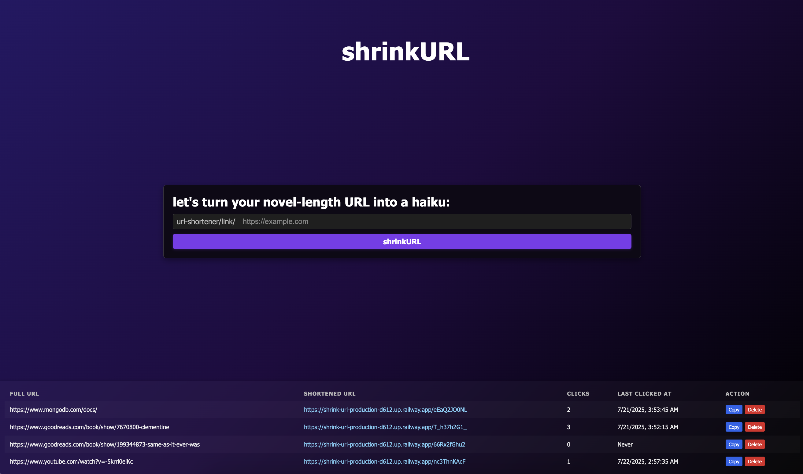

# shrinkURL — MERN Stack URL Shortener + Analytics Dashboard

A full-stack URL shortener that generates unique, trackable short links for long URLs. Tracks usage data including click count and last access time. Built to simulate production-ready SaaS utilities, with REST APIs, persistent storage, and a live dashboard.

> Powered by TypeScript, Express, MongoDB, React (Vite), Railway, and Vercel.

---

## Motivation

Modern web applications often rely on compact URLs for usability, branding, and analytics. This project demonstrates API design, data modeling, UI synchronization, and deployment in a lightweight clone of tools like Bitly and TinyURL.

---

## Project Overview

- Create shortened versions of long URLs with a NanoID-based generator
- Track real-time metrics (click count, timestamps, usage location)
- Manage all links via a dashboard with copy/delete tools and live refresh
- Modularized TypeScript backend with MongoDB persistence
- Frontend built with React (Vite) and deployed to Vercel
- Hosted backend using Railway with environment variable config support

---

## Features

- Shorten any valid URL and generate a 10-character identifier
- Auto-refreshing frontend table (every 60 seconds)
- Copy-to-clipboard and delete functionality for each link
- Redirect and analytics update via backend `/shortUrl/:id` route
- Stores:
  - Full URL
  - Shortened URL
  - Click count
  - Last clicked time
  - Last clicked location (via IP Geolocation API)
- RESTful API layer with Express + Mongoose
- Deployed backend (Railway) and frontend (Vercel)

---

## Architecture

```text
+-------------------------+     +---------------------------+
|    React Dashboard      | <-> |    Express API Server     |
| (DataTable, FormInput)  |     |  (TypeScript, REST API)   |
+-------------------------+     +------------+--------------+
                                             |
                                             v
                                  +---------------------+
                                  |   MongoDB (Atlas)   |
                                  |  shortUrl documents |
                                  +---------------------+

+---------------------+    
| IP Info API (geo)   | <------------------+
+---------------------+                    |
                                           |
                            On redirect: /shortUrl/:id

```
---

## Tech Stack

| Layer        | Technology                              | Purpose / Usage                                         |
|--------------|------------------------------------------|----------------------------------------------------------|
| **Frontend** | React (TypeScript)                       | Component-based UI using Vite for build tooling         |
|              | Axios                                    | HTTP client for REST API requests                       |
|              | CSS Modules                              | Scoped styling                                          |
|              | Vercel *(optional)*                      | Frontend deployment                                     |
| **Backend**  | Node.js + Express.js                     | Type-safe REST API server                               |
|              | TypeScript                               | Static typing and tooling                               |
|              | NanoID                                   | Generating short unique URLs                            |
|              | dotenv                                   | Environment config handling                             |
|              | Railway                                   | Backend deployment and hosting                         |
| **Database** | MongoDB Atlas                            | NoSQL database for storing URL mappings                 |
|              | Mongoose                                 | Data modeling and query layer                           |
| **Utilities**| axios (server)                           | IP geolocation lookup                                   |
|              | ts-node, nodemon                         | Dev server and TS compiler                             |

---

## Demo



---

## REST API Endpoints

Base URL: `https://your-railway-deployment-url/api`

### `POST /shortUrl`
Creates a new shortened URL

### `GET /shortUrl`
Returns a list of all stored URLs with analytics metadata

### `GET /shortUrl/:id`
Redirects to the original full URL and updates analytics

### `DELETE /shortUrl/:id`
Deletes a short URL by its database ID

---

## Environment Variables

### Backend .env
```bash
PORT=8080
CONNECTION_STRING=<your-mongodb-url>
TOKEN=<your-ipinfo-token>
```
### Frontend .env
```bash
VITE_SERVER_URL=https://your-railway-backend-url/api
```
---

## Setup & Installation

### 1. Clone the Repository

```bash
git clone https://github.com/ananyadua27/shrink-URL.git
cd shrink-URL
```

### 2. Configure Environment Variables

### 3. Run  - Frontend and Backend
```bash
npm run dev
```
---

## Deployment

### Backend

Deployed via [**Railway**](https://railway.app/)

- Environment variables managed in Railway dashboard
- Default port: `8080` (can be configured via `.env`)
- After deployment, use the generated domain (e.g. `https://shrink-url-production-abc123.up.railway.app`) as your base API URL

### Frontend 

Deployed via Vercel

- Framework Preset: Vite
- Root Directory: client-app/url-shortener
- Build Command: npm run build
- Output Directory: dist

---

## License

MIT License © Ananya Dua
